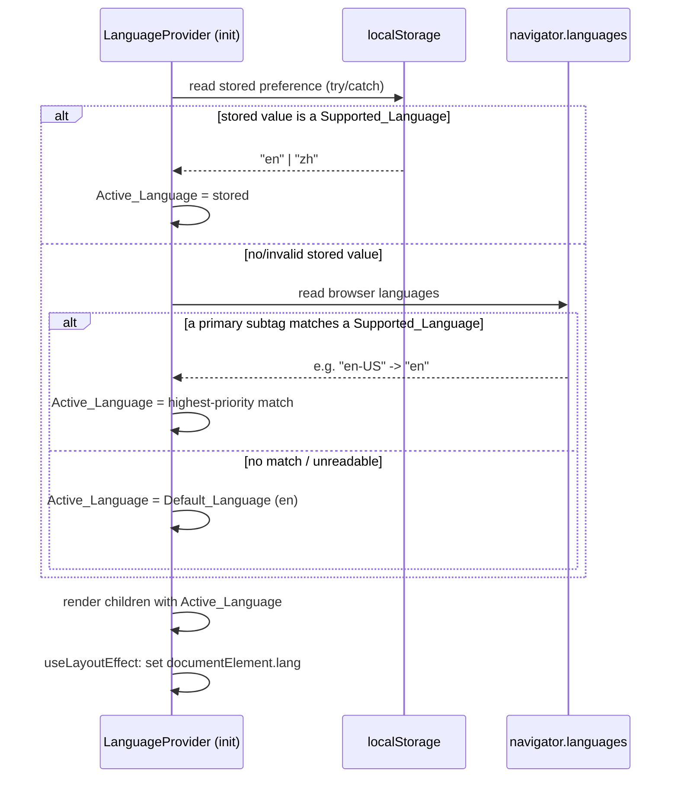

# Design Document

## Overview

This feature adds English (`en`) and Simplified Chinese (`zh`) bilingual support to the Aurinara website. Today every user-facing string is hardcoded in English across `src/data/siteData.tsx`, the page components under `src/pages/`, and the layout components (`Header`, `Footer`, `SiteLayout`). The design introduces a small, custom internationalization (i18n) layer built on React context plus a structured translation store, a `Language_Switcher` control in the header (desktop and mobile), browser-aware initial language detection, persistence to `localStorage`, and synchronization of the document root `lang` attribute. Routes stay language-independent: the active language lives in application state and is restored from the persisted preference, never encoded in the URL path.

### Design Goals

- Resolve the active language **before first paint** so visitors never see wrong-language or untranslated flicker (Requirement 4.6).
- Keep route paths identical across languages (Requirement 7.1).
- Guarantee a defined fallback for every lookup: active language → default language → raw key (Requirements 2.5, 2.6).
- Degrade gracefully when `localStorage` is unavailable or unreadable (Requirements 4.5, 5.4).
- Keep the implementation dependency-free and small.

### Key Decision: Custom Context vs. i18n Library

The design uses a **lightweight custom i18n context** rather than a library such as `react-i18next` or `i18next`.

Rationale:

- **Scope is small and static.** Two languages, a fixed set of pages, and a finite set of strings. There is no runtime locale loading, no server, and no user-generated content.
- **No advanced i18n features are required.** The content needs no pluralization rules, gendered forms, ICU message formatting, or runtime interpolation. A simple key → string lookup with fallback covers every acceptance criterion.
- **Bundle size and dependencies.** `i18next` + `react-i18next` add a non-trivial dependency and bundle weight for capabilities this site will not use. Avoiding them keeps the Vite build lean.
- **Full control over detection/persistence semantics.** The requirements specify exact detection ordering, validation, and fallback behavior. A custom layer implements these precisely and makes them directly testable as pure functions.

Trade-off: if the site later needs many languages, interpolation, or pluralization, migrating to a library would be warranted. The custom layer is intentionally structured (pure resolver functions + a thin context) so that migration would be localized to the provider and the translation store, not the component tree.

## Architecture

### High-Level Structure

The i18n layer is introduced as a new module group under `src/i18n/` and wired in at the application root, above the router so language state survives all navigation.

```mermaid
graph TD
    Main[main.tsx] --> LP[LanguageProvider]
    LP --> BR[BrowserRouter]
    BR --> App[App / Routes]
    App --> SL[SiteLayout]
    SL --> Header
    SL --> Footer
    SL --> Pages[Page components]
    Header --> LS[LanguageSwitcher]
    LP -. exposes useLanguage \(language, setLanguage, t\) .-> Header
    LP -. .-> Footer
    LP -. .-> Pages
    LP --> Store[(Translation Store + siteContent)]
    LP --> Pref[Preference Store / localStorage]
    LP --> Doc[document.documentElement.lang]
```

### Module Layout

```
src/i18n/
  types.ts            # Language, TranslationKey, TranslationStore types
  config.ts           # SUPPORTED_LANGUAGES, DEFAULT_LANGUAGE, STORAGE_KEY
  detect.ts           # pure detection + validation functions
  store.ts            # translation strings (en/zh) keyed by TranslationKey
  content.ts          # structured siteData content (en/zh) + language-independent icons
  LanguageProvider.tsx# context, state, persistence, document lang sync
  useLanguage.ts      # hook exposing { language, setLanguage, t, content, warning }
```

### Initialization Flow (before first paint)

The provider computes the initial language synchronously inside a lazy `useState` initializer, so the very first render already has the correct language. This satisfies Requirement 4.6 (language set before initial content renders, within 100ms) without any async loading.



### Language Change Flow

```mermaid
sequenceDiagram
    participant U as Visitor
    participant LS as LanguageSwitcher
    participant LP as LanguageProvider
    participant Pref as localStorage
    participant DOM as document root
    U->>LS: click language option
    LS->>LP: setLanguage(requested)
    alt requested is unsupported
        LP->>LP: retain current; set warning("unsupported")
    else requested == current
        LP->>LP: no-op (text unchanged)
    else requested is a different Supported_Language
        LP->>LP: Active_Language = requested (state update -> re-render)
        LP->>Pref: write preference (try/catch)
        alt write fails
            LP->>LP: keep language; set warning("not persisted")
        end
        LP->>DOM: useLayoutEffect updates lang attribute
    end
```

Because state lives in a single context above the router, a state change re-renders the entire subtree, re-resolving every `t(key)` and structured-content read in the new language without a page reload (Requirements 2.7, 3.7).

## Components and Interfaces

### `config.ts`

```ts
export const SUPPORTED_LANGUAGES = ["en", "zh"] as const;
export type Language = (typeof SUPPORTED_LANGUAGES)[number];
export const DEFAULT_LANGUAGE: Language = "en";
export const STORAGE_KEY = "aurinara.language";
```

### `detect.ts` (pure functions — primary PBT targets)

```ts
// True iff value is exactly one of SUPPORTED_LANGUAGES.
function isSupportedLanguage(value: unknown): value is Language;

// Validate a persisted preference. Returns the Language if supported, else null.
function normalizeStoredPreference(raw: string | null): Language | null;

// Given an ordered browser language list (navigator.languages),
// return the first entry whose primary subtag (case-insensitive) matches a
// Supported_Language, else null. "en-US" -> "en", "ZH-Hans-CN" -> "zh".
function matchBrowserLanguage(browserLanguages: readonly string[]): Language | null;

// Full resolution per Requirement 4: stored preference -> browser match -> default.
// `readStored` and `readBrowser` are injected so the function stays pure/testable.
function resolveInitialLanguage(
  readStored: () => string | null,
  readBrowser: () => readonly string[]
): Language;
```

`resolveInitialLanguage` never throws: callers pass readers wrapped so that a thrown storage access yields `null` (Requirement 4.5).

### `store.ts` and translation lookup

```ts
export type TranslationKey = string;
// Per-language flat map of key -> localized string.
export type TranslationStore = Record<Language, Record<TranslationKey, string>>;

// Resolve a key in the active language with fallback chain:
// active -> default -> key (returned unchanged).
function translate(
  store: TranslationStore,
  language: Language,
  key: TranslationKey
): string;
```

### `LanguageProvider.tsx` / `useLanguage.ts`

```ts
type LanguageWarning =
  | null
  | { kind: "unsupported"; requested: string }
  | { kind: "not-persisted"; language: Language };

interface LanguageContextValue {
  language: Language;                 // always a Supported_Language
  setLanguage: (requested: string) => void;
  t: (key: TranslationKey) => string; // active -> default -> key
  content: SiteContent;               // structured siteData for active language
  warning: LanguageWarning;           // surfaced indication for 1.5 / 5.4
}

function useLanguage(): LanguageContextValue;
```

`setLanguage` rules:

- If `requested` is not a Supported_Language: retain current language, set `warning = { kind: "unsupported" }` (Requirement 1.5).
- If `requested === language`: no state change, text unchanged (Requirement 3.6).
- Otherwise: update state; attempt to persist; on write failure set `warning = { kind: "not-persisted" }` but keep the new language for the session (Requirement 5.4).

Document `lang` sync uses `useLayoutEffect` keyed on `language`, writing `document.documentElement.lang = language` (a BCP 47 tag drawn from Supported_Languages). If for any reason `language` is not supported, it writes `DEFAULT_LANGUAGE` (Requirements 6.1–6.4).

### `LanguageSwitcher.tsx`

A presentational control rendered twice: in the desktop nav cluster and inside the mobile menu of `Header`.

```ts
interface LanguageSwitcherProps {
  variant: "desktop" | "mobile";
}
```

Behavior and accessibility:

- Renders one button per Supported_Language with labels "EN" / "中文" (Requirement 3.3).
- The active option is visually distinct via a non-color cue — `aria-current="true"` plus a font-weight/border treatment, not color alone (Requirement 3.4).
- Clicking an option calls `setLanguage`; selecting the active option is a no-op (Requirements 3.5, 3.6).

### Refactor of `Header`, `Footer`, Pages

All components read text via `useLanguage()`:

- `Header`: nav labels, "Sign in", "Request demo", brand tagline, and the mobile-menu toggle `aria-label` come from `t(...)`; `navItems` labels resolve through translation keys (see Data Models). Mounts `<LanguageSwitcher variant="desktop" />` in the desktop cluster and `<LanguageSwitcher variant="mobile" />` in the mobile menu.
- `Footer`: copyright line and link labels via `t(...)`.
- `SiteLayout`: no user-facing text; unchanged except it remains under the provider.
- Pages (`Home`, `Platform`, `Solutions`, `Workflow`, `Trust`, `Contact`): every heading, eyebrow, paragraph, list item, inline array (e.g. Home console rows, Workflow/Trust checklists, Solutions use-case cards), and the entire Contact form (labels, placeholders, select options, button, disclaimer) read from `t(...)` or structured content.

Route paths in `App.tsx` and all `Link`/`NavLink` `to` values stay unchanged (Requirement 7.1).

## Data Models

### Translation Key Namespacing

Keys use a dotted `area.element` convention for stability and readability:

- Layout: `nav.platform`, `nav.solutions`, `nav.workflow`, `nav.trust`, `nav.contact`, `header.signIn`, `header.requestDemo`, `header.brand`, `header.tagline`, `header.menuToggle`, `footer.copyright`, `footer.security`, `footer.platform`, `footer.contact`.
- Pages: `home.hero.title`, `home.hero.body`, `contact.form.nameLabel`, `contact.form.namePlaceholder`, `contact.form.interest.sdtm`, etc.
- Structured siteData items reference keys by stable `id` (below).

### `TranslationStore`

```ts
// store.ts
export const translations: TranslationStore = {
  en: {
    "nav.platform": "Platform",
    "header.requestDemo": "Request demo",
    "footer.copyright": "© 2026 Aurinara Clinical AI. All rights reserved.",
    // ...all scalar strings
  },
  zh: {
    "nav.platform": "平台",
    "header.requestDemo": "预约演示",
    "footer.copyright": "© 2026 Aurinara Clinical AI 版权所有。",
    // ...all scalar strings
  },
};
```

The English map is the source of truth for the full key set; the Chinese map mirrors the same keys. Any missing `zh` key falls back to `en`, then to the raw key (Requirements 2.5, 2.6, 3.8).

### Structured Site Content (`content.ts`)

`siteData` mixes translatable text with language-independent data (Lucide icon components, metric values like `"4"` / `"100%"`, layout hints). The refactor **separates the language-independent structure (icons, ids) from the translatable text**, so icons are defined once and never duplicated per language.

```ts
import type { LucideIcon } from "lucide-react";

// Language-independent skeleton: stable id + icon, defined once.
interface CapabilityShape { id: string; icon: LucideIcon; }
interface NavShape { id: string; href: string; }

// Per-language text for each id.
interface SiteContent {
  nav: { id: string; href: string; label: string }[];
  capabilities: { id: string; icon: LucideIcon; title: string; text: string }[];
  metrics: { value: string; label: string }[];      // value is language-independent
  workflowSteps: { id: string; title: string; text: string }[];
  solutions: { id: string; eyebrow: string; title: string; description: string; points: string[] }[];
  trustItems: { id: string; icon: LucideIcon; title: string; text: string }[];
  deliverables: { id: string; icon: LucideIcon; title: string; text: string }[];
}

// buildSiteContent(language) merges the icon/id skeleton with translated strings
// resolved through translate(store, language, key) so the same fallback chain applies.
function buildSiteContent(language: Language): SiteContent;
```

Implementation approach: the skeleton arrays hold `{ id, icon, href }`; text fields are produced by `translate()` against keys derived from the id (e.g. `capability.<id>.title`). This keeps a single fallback path for every string, including structured content, and avoids divergent array lengths between languages (`points` lists use a fixed set of keys per solution id).

The existing exports in `src/data/siteData.tsx` are replaced: `navItems`, `capabilities`, `metrics`, `workflowSteps`, `solutions`, `trustItems`, `deliverables` become outputs of `buildSiteContent(language)` consumed via `useLanguage().content`.

### Preference Store Record

A single `localStorage` entry:

| Key | Value | Notes |
| --- | --- | --- |
| `aurinara.language` | `"en"` \| `"zh"` | Written on explicit selection only. Any other stored value is treated as absent and ignored. |

### State Model

```ts
interface LanguageState {
  language: Language;          // always valid
  warning: LanguageWarning;    // transient indication for unsupported/not-persisted
}
```

## Correctness Properties

*A property is a characteristic or behavior that should hold true across all valid executions of a system — essentially, a formal statement about what the system should do. Properties serve as the bridge between human-readable specifications and machine-verifiable correctness guarantees.*

These properties apply to the **pure logic layer** of this feature: language detection/validation (`detect.ts`), the translation fallback resolver (`translate`), the `setLanguage` reducer logic, the `buildSiteContent` mapping, and the lang-attribute mapping. The UI rendering, switcher presence, document-`lang` side effects, and routing behavior are covered by example/component tests in the Testing Strategy (they assert fixed component output rather than universal input-varying properties).

### Property 1: Resolved initial language is always supported

*For all* combinations of stored-preference values (any string, empty, or null) and browser language lists (any sequence of strings), `resolveInitialLanguage` returns a value that is a member of `SUPPORTED_LANGUAGES`.

**Validates: Requirements 1.3**

### Property 2: A stored supported preference wins over the browser

*For all* stored values that are members of `SUPPORTED_LANGUAGES` and *for all* browser language lists, `resolveInitialLanguage` returns the stored value.

**Validates: Requirements 4.1, 5.2**

### Property 3: Browser detection picks the highest-priority matching subtag

*For all* browser language lists containing at least one entry whose primary subtag matches a Supported_Language (case-insensitive, e.g. `"en-US"` → `en`, `"ZH-Hans-CN"` → `zh`), when no stored preference exists, `matchBrowserLanguage` / `resolveInitialLanguage` returns the Supported_Language of the earliest matching entry in list order.

**Validates: Requirements 4.2**

### Property 4: With no resolvable preference, resolution returns the default

*For all* stored values that are absent, empty, or not a Supported_Language, combined *for all* browser language lists in which no entry's primary subtag matches a Supported_Language, `resolveInitialLanguage` returns the Default_Language (`en`).

**Validates: Requirements 1.4, 4.3, 4.4, 5.3**

### Property 5: Translation lookup follows the active → default → key fallback chain

*For all* translation stores, active languages, and keys: if the key exists in the active language, `translate` returns the active-language string; otherwise if it exists in the Default_Language, it returns the Default_Language string; otherwise it returns the key unchanged.

**Validates: Requirements 2.5, 2.6, 3.8**

### Property 6: Language validation accepts exactly the supported set

*For all* strings, `isSupportedLanguage` returns true if and only if the string is exactly `"en"` or `"zh"`.

**Validates: Requirements 1.1**

### Property 7: Selecting a different supported language sets and persists it

*For all* pairs of current and target languages drawn from `SUPPORTED_LANGUAGES` where target differs from current, `setLanguage(target)` results in an Active_Language equal to target and writes target to the Preference_Store.

**Validates: Requirements 3.5, 5.1**

### Property 8: Selecting the current language is a no-op (idempotence)

*For all* current languages in `SUPPORTED_LANGUAGES`, calling `setLanguage(current)` leaves the Active_Language unchanged and surfaces no warning.

**Validates: Requirements 3.6**

### Property 9: Requesting an unsupported language retains the current language and warns

*For all* current languages in `SUPPORTED_LANGUAGES` and *for all* requested strings that are not members of `SUPPORTED_LANGUAGES`, `setLanguage(requested)` leaves the Active_Language unchanged and surfaces an "unsupported" indication.

**Validates: Requirements 1.5**

### Property 10: A persistence failure still applies the language for the session and warns

*For all* target languages in `SUPPORTED_LANGUAGES` differing from the current language, when writing to the Preference_Store throws, `setLanguage(target)` still sets the Active_Language to target and surfaces a "not-persisted" indication.

**Validates: Requirements 5.4**

### Property 11: Structured site content is fully resolved and shape-stable across languages

*For all* languages in `SUPPORTED_LANGUAGES`, `buildSiteContent(language)` produces collections whose array lengths match those of the Default_Language, and every text field equals the result of the active → default → key fallback chain for its key (so no field is empty or untranslated when a translation exists).

**Validates: Requirements 2.3**

### Property 12: Language-to-`lang`-attribute mapping is safe

*For all* values, the lang-attribute resolver returns the value when it is a member of `SUPPORTED_LANGUAGES`, and otherwise returns the Default_Language code; the result is always a single non-empty BCP 47 tag from `SUPPORTED_LANGUAGES`.

**Validates: Requirements 6.3, 6.4**

### Property 13: Initial language resolution is independent of the route path

*For all* route paths and *for all* stored/browser inputs, the language resolved on load equals `resolveInitialLanguage(stored, browser)` and does not vary with the path.

**Validates: Requirements 7.3, 7.4**

## Error Handling

| Scenario | Handling | Requirement |
| --- | --- | --- |
| `localStorage` read throws (private mode, disabled storage) | The stored-preference reader is wrapped in try/catch and returns `null`; resolution falls through to browser detection then default. No blocking error. | 4.5 |
| Stored value is empty/null/unsupported | `normalizeStoredPreference` returns `null`; treated as no preference. | 4.4, 5.3 |
| `localStorage` write throws | `setLanguage` catches the error, keeps the new language in state for the session, and sets `warning = { kind: "not-persisted" }`. | 5.4 |
| Unsupported language requested via `setLanguage` | Current language retained (or default if somehow none), `warning = { kind: "unsupported" }`. | 1.5 |
| Translation key missing in active language | Fall back to Default_Language string. | 2.5, 3.8 |
| Translation key missing in active and default | Return the raw key string (visible, non-crashing placeholder). | 2.6 |
| Browser exposes no `navigator.languages` / empty list | Treated as no match; resolution returns default. | 4.3 |
| Active language somehow not supported when writing `lang` attribute | lang-attribute resolver substitutes the Default_Language code. | 6.3 |

The `warning` value is surfaced through context so the UI can render a non-blocking, dismissible indication (e.g. a small inline notice near the switcher). Warnings never prevent the language change or block rendering.

## Testing Strategy

### Tooling

- **Test runner:** Vitest (the standard choice for a Vite + React + TypeScript project). It is not currently installed; the implementation will add `vitest`, `@testing-library/react`, `@testing-library/user-event`, and `jsdom` as dev dependencies and configure a `test` script.
- **Property-based testing:** `fast-check` (the standard PBT library for TypeScript). Properties are NOT implemented from scratch.

### Dual Testing Approach

- **Property tests** verify the universal logic properties (Properties 1–13) across many generated inputs. Each property test runs a **minimum of 100 iterations** and is tagged with a comment referencing the design property in the format:
  `// Feature: multilingual-support, Property {number}: {property_text}`
- **Unit / component tests** verify concrete rendering, switcher behavior, side effects (document `lang`), and routing behavior that are not input-varying universals.

### Property Test Mapping

Each correctness property maps to a single property-based test:

- P1–P4, P13 → generators over arbitrary stored strings and arrays of language-tag-like strings, asserting resolver outputs.
- P5 → generator over stores (random key/value maps with controlled presence in active/default) and keys, asserting the fallback chain.
- P6 → generator over arbitrary strings asserting the iff condition.
- P7–P10 → generators over supported/unsupported language values driving the `setLanguage` reducer with a mocked Preference_Store (including a throwing mock for P10), asserting state and warning.
- P11 → generator over `SUPPORTED_LANGUAGES` asserting `buildSiteContent` array parity and field resolution.
- P12 → generator over arbitrary values asserting the lang-attribute mapping.

Pure functions (`detect.ts`, `translate`, `buildSiteContent`, lang-attribute mapping) are tested directly. The `setLanguage` logic is extracted into a pure reducer so its branches (P7–P10) are testable without mounting React; storage access is injected.

### Example / Component Tests (non-PBT criteria)

- **Layout & page coverage (2.1, 2.2, 2.4):** render `Header`, `Footer`, and each page in `en` and `zh`; assert language-appropriate strings appear and the other language's distinctive strings are absent. The Contact test asserts all labels, placeholders, select options, and the button.
- **Re-render on change (2.7, 3.7):** render a subtree, switch language via the provider, assert previous-language strings are gone and no full reload/navigation occurred.
- **Switcher (3.1–3.4):** assert the switcher is present in the desktop cluster and inside the opened mobile menu, renders exactly two options with labels `EN` / `中文`, and marks the active option with `aria-current="true"` (a non-color cue).
- **Initial resolution before paint (4.6):** render the provider with a stubbed stored preference and assert the first committed render reflects that language (synchronous lazy init — no async tick).
- **Document `lang` (6.1, 6.2, 6.4):** after initial render assert `document.documentElement.lang` equals the active language; after switching assert it updates and remains a single non-empty supported tag.
- **Routing (7.1, 7.2, 7.5):** with a set language, render under the router, navigate across several routes (and to an unknown path that redirects to `/`), asserting the language is unchanged at each step and route paths do not vary by language.

### Smoke / Config Checks

- **1.2:** assert `DEFAULT_LANGUAGE === "en"`.
- **7.1 (structural):** assert the route table paths are the fixed set `['/', '/platform', '/solutions', '/workflow', '/trust', '/contact']`.

### Coverage Goal

Every acceptance criterion in the requirements maps to at least one property test, component/example test, or smoke check above, giving full traceable coverage of Requirements 1–7.
